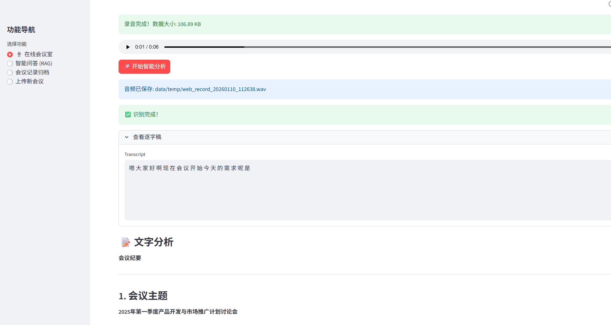
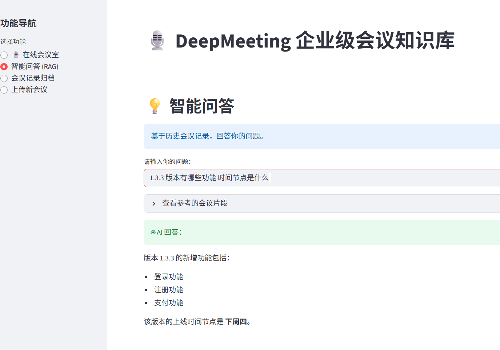
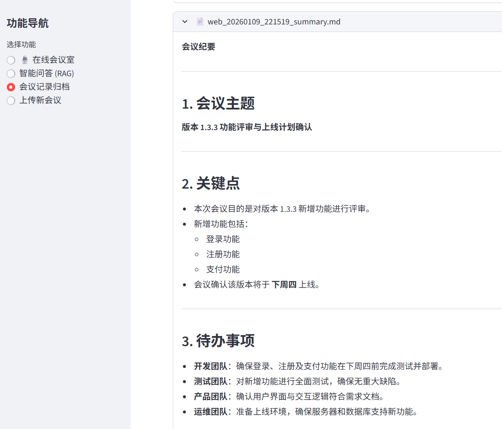
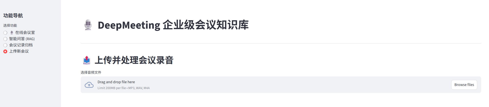

# DeepMeeting - 企业级 AI 智能会议助手

**🔒 100% 本地化部署，数据隐私零泄露！**

DeepMeeting 是一款全栈式 AI 会议解决方案。它不仅能将在线会议以及会议录音转录为文字并生成会议纪要，更内置了 **RAG (检索增强生成)** 知识库，让你的历史会议记录变成可交互、可查询的“企业大脑”。
  

## 🌟 核心功能

*   **🛡️ 极致安全**：从语音识别 (Whisper、Paraformer) 到大模型 (Ollama) 再到向量库 (FAISS/Chroma)，全链路离线运行，网线拔了也能用。
*   **🧠 会议知识库 (RAG)**：自动将所有会议纪要向量化存入本地数据库。你可以随时问 AI：“上个月王总关于产品定价是怎么说的？”，它会跨会议检索并回答。
*   **🖥️ 可视化 Web 界面**：内置 Streamlit 管理后台，支持上传文件、查看历史记录和智能问答。
*   **🎙️ 实时会议助手**：支持实时监听麦克风，语音转文字上屏，并自动生成纪要。
*   **📧 自动化工作流**：会议结束后自动发送邮件通知给相关人员。

---
## 🛠️ 技术架构

本项目采用模块化设计，易于扩展和维护：
```text
ai-meeting-assistant/
├── app/
│   ├── asr/          # 语音识别 (Whisper 或 FunASR/Paraformer)
│   ├── llm/          # 大模型交互 (LangChain + Ollama)
│   ├── rag/          # 知识库 (FAISS/ChromaDB + SentenceTransformers)
│   ├── audio/        # 音频录制与 VAD (SoundDevice)
│   └── utils/        # 工具库
├── data/             # 数据存储 (录音、转录、向量索引)
├── web_app.py        # Streamlit Web 入口
└── main.py           # CLI 命令行入口
```
---

## 🚀 快速开始

### 1、 Docker 部署（支持 Tongyi/openai/glm/本地）
**快速启动（测试阶段使用 Tongyi）**
```bash
# 设置通义千问 API Key
echo "DASHSCOPE_API_KEY=你的Key" >> env.development
# 构建并启动
docker compose build
docker compose up -d
# 访问 Web
open http://localhost:8501
```

**切换到 Ollama（本地大模型）**
```ini
# env.development 中设置
LLM_PROVIDER=ollama
OLLAMA_BASE_URL=http://localhost:11434
OLLAMA_MODEL=qwen2:1.5b
```
> Ollama 容器可按需添加到 compose；当前默认使用 Tongyi 测试。

### 2、 本机部署

**前置要求**:
*   **Python**: 3.9, 3.10 或 3.11 (暂不推荐 3.12+, 部分依赖可能未适配)

1.  **安装 Ollama** (用于运行 LLM):
    *   下载并安装 [Ollama](https://ollama.com)。
    *   拉取模型：
        *   8G 内存: `ollama run qwen2:1.5b`
        *   16G+ 内存: `ollama run qwen2:7b` (强烈推荐)

2.  **安装 Python 依赖**:
    ```bash
    python3 -m venv .venv

    source .venv/bin/activate
    
    pip install --upgrade pip
    
    pip install -r requirements.txt
    ```

### 2. 配置项目
复制 `.env.development` 为 `.env` 并修改配置（示例）：

```ini
# 工作模式: file (文件批处理) / realtime (实时录音)
MODE=file

# LLM 设置
LLM_PROVIDER=ollama
WHISPER_MODEL_SIZE=base

# ASR 设置（二选一）
# 1) 使用 Whisper（默认）
ASR_PROVIDER=whisper
# 2) 使用 FunASR/Paraformer（推荐中文场景）
# 设为 funasr 后自动加载以下组件（ModelScope 自动下载）
# 主模型（中文 ASR）: paraformer-zh
# 端点检测（VAD）: fsmn-vad
# 标点恢复（Punc）: ct-punc-zh
# ASR_PROVIDER=funasr
# ASR_FUNASR_MODEL=paraformer-zh
# ASR_FUNASR_VAD=fsmn-vad
# ASR_FUNASR_PUNC=ct-punc-zh

# 邮件通知 (可选)
ENABLE_EMAIL_NOTIFICATION=true
EMAIL_SENDER=your_name@company.com
# ...
```
> 切换 ASR 引擎后，无需改代码。Web 界面和 CLI 会自动按 `.env` 选择 Whisper 或 FunASR。


#### 🖥️ 启动 Web 界面 (推荐)
这是最直观的使用方式，支持文件上传和知识库问答。
```bash
streamlit run web_app.py
```
浏览器访问: `http://localhost:8501`

#### 📂 批量处理文件 (CLI)
将录音文件放入 `data/` 目录，然后运行：
```bash
python3 main.py
```

### 项目使用示列
- 在线会议

- 智能问答

- 会议记录

- 上传会议


**环境变量关键项**
- ASR_PROVIDER=whisper|funasr（中文推荐 funasr）
- VECTOR_STORE=chroma|faiss|auto（默认 auto：优先 Chroma，失败回退 FAISS）
- FASTEMBED_MODEL_DIR=BAAI/bge-small-zh-v1.5（支持自动回退到 sentence-transformers）
- HF_ENDPOINT=https://hf-mirror.com（国内镜像加速）

程序会自动处理所有文件，生成摘要并存入知识库。

#### 🎙️ 开启实时会议
修改 `.env` 中 `MODE=realtime`，然后在终端运行：
```bash
python3 main.py
```
*注意：macOS 用户需在外部 Terminal 中运行以获取麦克风权限。*

---